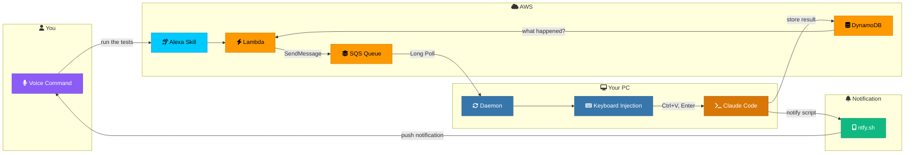
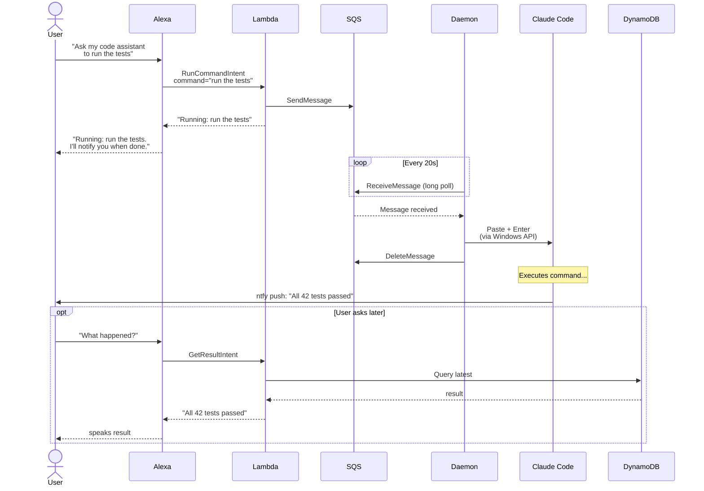

<p align="center">
  <picture>
    <source media="(prefers-color-scheme: dark)" srcset="https://img.shields.io/badge/%F0%9F%8E%99%EF%B8%8F_Alexa_%E2%86%94_Claude_Code-Voice_Bridge-8B5CF6?style=for-the-badge&labelColor=1a1a2e">
    
  </picture>
</p>

<p align="center">
  <strong>Voice-control your Claude Code REPL from across the room</strong>
</p>

<p align="center">
  
  
  
  
  
</p>

---

> **"Alexa, ask my code assistant to run the tests"**
>
> Alexa sends the command to your Claude Code terminal. Claude runs it, then pushes the result to your phone via [ntfy.sh](https://ntfy.sh).

---

## How It Works

```
   You                    Cloud                        Your PC
  ------            ----------------              ----------------

  "Alexa,              Alexa Skill                  Background
   run the    ───>     (Lambda)       ───>          Daemon
   tests"              Sends to SQS                 Polls SQS
                                                       │
                                                       ▼
                       ntfy.sh        <───     Claude Code REPL
                       + DynamoDB              Executes command
                           │                   Sends result back
                           ▼
                      Phone push:
                      "All 42 tests
                       passed"
```

### Architecture



### Step by Step



---

## Features

| Feature | Description |
|---------|-------------|
| **Voice commands** | Speak naturally — "run the tests", "check git status", "commit my changes" |
| **Push notifications** | Get instant phone notifications via [ntfy.sh](https://ntfy.sh) when Claude finishes (Alexa-originated commands only) |
| **Result recall** | Ask "Alexa, what happened?" anytime to hear the latest result |
| **Window targeting** | Matches your terminal by window class — works even when Claude Code changes its title |
| **Auto-notification** | Stop hook in Claude Code fires automatically — no manual CLAUDE.md rules needed |
| **Crash resilient** | Daemon auto-restarts with exponential backoff; clipboard retries; poison messages can't crash-loop |
| **Reliable input** | Uses Win32 `SendInput` API with correct 64-bit struct layout and `AttachThreadInput` for focus; `PostMessage` fallback |
| **Zero dependencies on Windows** | Keyboard injection uses raw `ctypes` — no pywinauto, no COM |
| **One-command setup** | `make setup` provisions all AWS resources and configures locally |
| **Clean teardown** | `make teardown` removes everything from AWS and your machine |

---

## Prerequisites

- **Windows 11** with [Windows Terminal](https://aka.ms/terminal)
- **Python 3.13+** with [`uv`](https://docs.astral.sh/uv/)
- **AWS CLI** configured (`aws configure`)
- **Alexa Developer Account** at [developer.amazon.com](https://developer.amazon.com)
- **ntfy app** on your phone — [Android](https://play.google.com/store/apps/details?id=io.heckel.ntfy) / [iOS](https://apps.apple.com/app/ntfy/id1625396347) *(for push notifications when Claude finishes)*

---

## Quick Start

### 1. Clone & Setup

```bash
git clone https://github.com/your-username/alexa-claude-bridge.git
cd alexa-claude-bridge
make setup
```

This runs three things:
- `make infra` — Creates SQS queue, DynamoDB table, and IAM role in AWS
- `make install` — Installs Python dependencies via `uv sync`
- `make bridge-install` — Creates `~/.claude-bridge/` config and installs a Stop hook in `~/.claude/settings.json` for auto-notifications

### 2. Create the Alexa Skill

1. Go to [Alexa Developer Console](https://developer.amazon.com/alexa/console/ask)
2. **Create Skill** → Custom → Provision your own
3. Copy the contents of `skill/interaction_model.json` into the **JSON Editor** under Interaction Model
4. Set the **Endpoint** to your Lambda function ARN
5. **Build** the model
6. Save your Skill ID:
   ```bash
   echo "amzn1.ask.skill.xxxxxxxx" > .skill-id
   ```

### 3. Deploy Lambda

```bash
make deploy
```

### 4. Configure Push Notifications

1. Install the **ntfy** app on your phone ([Android](https://play.google.com/store/apps/details?id=io.heckel.ntfy) / [iOS](https://apps.apple.com/app/ntfy/id1625396347))
2. Pick a random topic name (e.g., `claude-bridge-a1b2c3d4`) and add it to `~/.claude-bridge/config.json`:
   ```json
   "ntfy_topic": "claude-bridge-a1b2c3d4"
   ```
3. Open the ntfy app → tap **+** → subscribe to the same topic name

Notifications are sent **only** for Alexa-originated commands, not when you type directly into Claude Code.

### 5. Start the Bridge

```bash
make start
```

Now talk to Alexa:

> **"Alexa, ask my code assistant to run the tests"**

---

## Voice Commands

### Sending Commands

| Say this... | Claude receives... |
|-------------|-------------------|
| "Alexa, ask my code assistant to **run the tests**" | `run the tests` |
| "Alexa, tell my code assistant to **check git status**" | `check git status` |
| "Alexa, ask my code assistant to **commit my changes**" | `commit my changes` |
| "Alexa, tell my code assistant to **explain the auth module**" | `explain the auth module` |

You can use natural phrasing — "run", "execute", "do", "check", "try", "launch", "go ahead and", etc.

### Checking Results

| Say this... |
|-------------|
| "Alexa, ask my code assistant **what happened**" |
| "Alexa, ask my code assistant **is it done**" |
| "Alexa, ask my code assistant **what's the result**" |

---

## Configuration

### `~/.claude-bridge/config.json`

```jsonc
{
  // Required
  "command_queue_url": "https://sqs.us-east-1.amazonaws.com/.../claude-bridge-commands",
  "aws_region": "us-east-1",

  // Result storage
  "results_table": "claude-bridge-results",

  // Push notifications (recommended)
  "ntfy_topic": "claude-bridge-your-random-id",  // Subscribe to this in the ntfy app
  "ntfy_server": "https://ntfy.sh",               // Default; change if self-hosting

  // Alexa voice notifications (optional fallback — get code from notifymyecho.com)
  "notify_me_access_code": "",

  // Window targeting — how the daemon finds your Claude Code terminal
  "window_class": "CASCADIA_HOSTING_WINDOW_CLASS",  // Windows Terminal
  "window_title": null,                               // Optional title filter
  "exclude_titles": ["Visual Studio Code"]            // Windows to skip
}
```

### Window Matching

The daemon finds your terminal by **window class** (stable) rather than title (which changes with every Claude Code task).

| Terminal | Window Class |
|----------|-------------|
| **Windows Terminal** | `CASCADIA_HOSTING_WINDOW_CLASS` |
| **cmd.exe** | `ConsoleWindowClass` |
| **ConEmu / Cmder** | `VirtualConsoleClass` |

If you use multiple Windows Terminal instances, add `window_title` to narrow down:
```json
"window_class": "CASCADIA_HOSTING_WINDOW_CLASS",
"window_title": "some-unique-text"
```

---

## Makefile Reference

### Workflow

```
make setup      ─── First-time: AWS infra + Python deps + bridge config
make deploy     ─── Package Lambda + deploy (+ update Alexa skill if .skill-id exists)
make start      ─── Activate bridge (start daemon)
make stop       ─── Deactivate bridge (stop daemon)
make status     ─── Show bridge status
make logs       ─── Tail daemon log
make teardown   ─── Destroy all AWS resources (irreversible)
```

### Testing & Debugging

```bash
# Send a test command without Alexa
make test-send CMD="hello world"

# Check the latest result in DynamoDB
make test-result

# Check SQS queue depth
make queue-status

# Tail Lambda CloudWatch logs
make lambda-logs

# Tail local daemon log
make logs
```

---

## Project Structure

```
alexa-claude-bridge/
├── src/alexa_claude_bridge/
│   ├── bridge.py          # CLI — install, start, stop, status, notify, logs
│   ├── config.py          # Shared path constants (single source of truth)
│   ├── daemon.py          # Background SQS poller with auto-restart
│   ├── keyboard.py        # Window targeting + keyboard injection (SendInput / PostMessage)
│   └── notifier.py        # Alexa Notify Me API client
├── lambda/
│   └── handler.py         # Alexa skill Lambda — intent routing, SQS/DynamoDB
├── skill/
│   └── interaction_model.json   # Alexa interaction model (intents + slots)
├── Makefile               # Full workflow automation
└── pyproject.toml         # Package metadata + dependencies
```

---

## Troubleshooting

| Problem | Cause | Fix |
|---------|-------|-----|
| Daemon stops immediately | Clipboard access violation (another app holds clipboard) | Fixed — clipboard retry with backoff; daemon auto-restarts up to 5 times |
| Text in clipboard but not pasted | `SendInput` struct was wrong size on 64-bit Windows | Fixed — INPUT struct now 40 bytes (includes MOUSEINPUT for correct union size) |
| Commands go to VS Code | VS Code title contains the match string | Set `window_class` in config (default now targets Windows Terminal) |
| "Window not found" | Wrong window class or Claude Code not running | Run `make status`, check `make logs`, verify terminal is open |
| Paste works but Enter doesn't fire | Timing too tight between paste and Enter | Fixed — increased delays; `AttachThreadInput` for reliable focus |
| Commands repeat / crash loop | Poison SQS message not deleted on failure | Fixed — `finally` block always deletes messages |
| Alexa says "I don't know that one" | Skill not built or invocation name mismatch | Rebuild skill in Alexa Developer Console |
| No push notification | `ntfy_topic` not set or app not subscribed | Add topic to config, subscribe in ntfy app |
| Notifications on every command | `pending-notify` not being cleaned up | Stop hook handles cleanup automatically |

---

## How Notifications Work

During `alexa-bridge install`, the bridge adds a **Stop hook** to `~/.claude/settings.json`. This hook runs automatically every time Claude Code finishes a response:

```bash
# The hook (added automatically — you don't need to touch this)
bash -c '[ -f ~/.claude-bridge/pending-notify ] && ~/.claude-bridge/notify "Task completed" && rm ~/.claude-bridge/pending-notify; true'
```

The `pending-notify` file is created by the daemon **only** when it injects an Alexa command. This means:
- **Alexa command** → daemon creates `pending-notify` → Claude completes → Stop hook fires notification → removes file
- **Direct typing** → no `pending-notify` → hook no-ops instantly

This is more reliable than the previous approach (a CLAUDE.md instruction) because hooks execute automatically at the shell level — Claude doesn't need to remember to check.

Both ntfy and Notify Me can run in parallel — configure either or both in `config.json`.

---

## AWS Resources Created

| Resource | Name | Purpose |
|----------|------|---------|
| SQS Queue | `claude-bridge-commands` | Command pipeline (Alexa → your PC) |
| DynamoDB Table | `claude-bridge-results` | Result storage (your PC → Alexa) |
| Lambda Function | `claude-bridge-alexa` | Alexa skill backend |
| IAM Role | `claude-bridge-lambda-role` | Lambda execution permissions |

All resources are created in your configured AWS region (default: `us-east-1`). Run `make teardown` to remove everything.

---

<p align="center">
  <sub>Built with <a href="https://claude.ai/code">Claude Code</a> and a healthy dislike for walking to the keyboard</sub>
</p>
